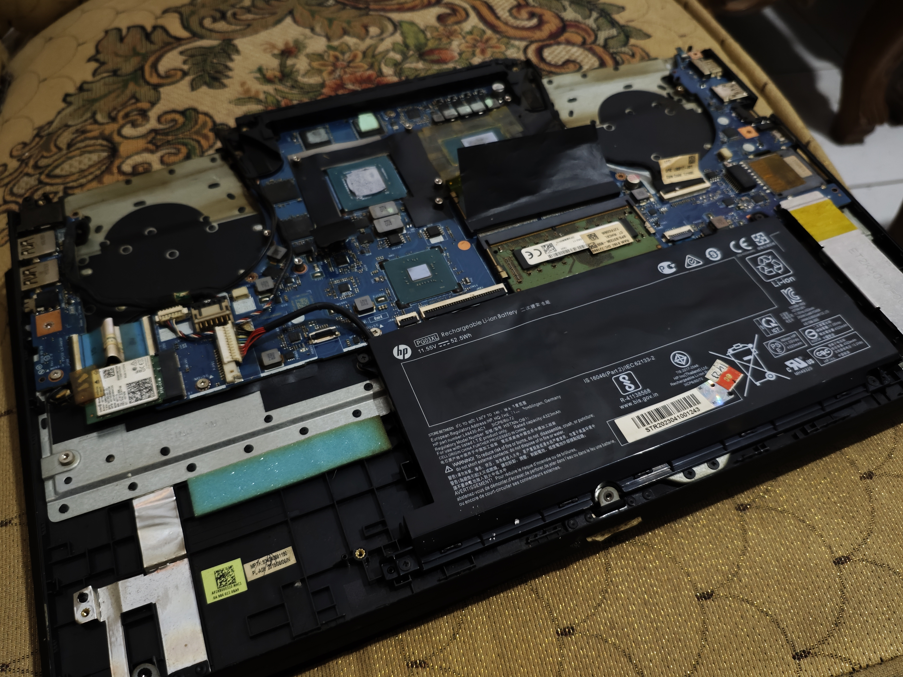

 # Technical-Case-Studies-Hardware-Diagnostics-System-Recovery
This repository documents my independent research and troubleshooting methodologies for complex computer system failures. My approach focuses on Root Cause Analysis (RCA) and systematic validation.

## Case Study: Progressive Thermal Degradation on Direct-Die Laptop CPU

### Summary
This case study documents a real-world investigation into **progressive thermal performance degradation** on a laptop with **direct-die CPU cooling**.  
The issue was not peak temperature on day one, but **thermal degradation over time**, even when using high-end thermal interface materials.

The purpose of this case study is to demonstrate **advanced troubleshooting, failure mechanism analysis, and material-aware reasoning** based on hands-on personal experience.

---

### System Context
- Device type: Laptop
- Cooling type: Direct-die CPU cooling
- Heatsink material: Copper (non–nickel plated)
- Operating pattern: Repeated thermal cycling under load

---

### Test Methodology

#### Stress Test
- **Tool:** Cinebench R15  
- **Purpose:** Sustained CPU load for thermal stress testing  
- **Consistency:** Same benchmark, same test scenario, repeated across all tests

#### Temperature Monitoring
- **Primary tool:** ThrottleStop (dominant monitoring tool)
- **Secondary reference:** CPUID HWMonitor (used for cross-verification)
- **Notes:**  
  - ThrottleStop was used for real-time core temperature observation  
  - HWMonitor data was referenced and captured in a single image for validation

This approach ensured **comparability across different testing periods**.

---

### Problem Description
After repasting the CPU, thermal performance would initially improve.  
However, after several days or weeks of normal usage and stress testing:

- CPU temperatures increased significantly
- Thermal throttling returned
- Performance degradation reappeared

Key characteristics:
- Initial temperatures were acceptable
- Degradation occurred progressively
- Repasting always helped temporarily
- The same pattern repeated regardless of paste brand

This indicated a **time-based failure mechanism**, not a one-time application error.

---

### Controlled Testing Results

#### Thermal Paste #1: Kingpin KPX
- **Day 1:** ~78°C  
  *(Cinebench R15, monitored via ThrottleStop)*
- **Day 7:** ~98°C  
  *(Same test conditions)*

Observation:
- Excellent initial performance
- Severe degradation within one week

Conclusion:
- Degradation speed was too fast to be caused by general hardware aging
- Suggested a material behavior issue rather than poor application or product quality

---

#### Thermal Paste #2: Thermalright TFX
- **Day 1:** ~79°C
- **Day 7:** ~78°C (stable)
- **Extended usage:** Gradual degradation observed over a longer period

Observation:
- Significantly better short-term stability than KPX
- Degradation still occurred, but at a slower rate

Conclusion:
- Higher viscosity delayed the failure mechanism
- However, it did not completely eliminate it

---

### Diagnostic Reasoning

Because:
- Both thermal pastes are high-end products
- Each showed a similar degradation trend with different time scales
- Mechanical mounting, airflow, and software factors were verified
- Power and stability issues were not observed

I concluded that:
> The root cause was **not thermal paste quality**,  
> but the **interaction between material properties, pressure, and thermal cycling** in a direct-die laptop environment.

---

### Failure Mechanism Identified: Pump-Out Effect

The primary failure mechanism for conventional thermal paste was identified as:

**Pump-Out Effect**
- Caused by repeated thermal expansion and contraction
- High mounting pressure and small contact area accelerate displacement
- Thermal paste is gradually pushed away from the die
- Initial temperatures appear normal but degrade over time

This explains why:
- Repasting always worked initially
- The problem consistently returned

---

### Escalation to Liquid Metal

After understanding the limitations of conventional thermal paste, I escalated to **liquid metal** not for short-term temperature reduction, but to **eliminate pump-out behavior**.

Liquid metal characteristics:
- Extremely high thermal conductivity
- Does not exhibit pump-out behavior
- Requires careful handling due to electrical conductivity

---

### Secondary Failure Mechanism Discovered

Even with liquid metal, thermal degradation was observed again over time.

Root cause analysis identified **material interaction** as the cause:
- Heatsink material: Copper
- Liquid metal base material: Gallium

Gallium interacts with copper through:
- Diffusion
- Surface alloying
- Formation of an intermetallic layer (visible as residue or “crust”)

This reaction temporarily reduces thermal efficiency.

---

### Critical Insight: Reaction Phase vs Failure

The key insight was that:
- Initial degradation with liquid metal was **not a failure**
- It represented a **material reaction phase**

Once:
- Gallium diffusion into copper stabilized
- Surface equilibrium was reached

Then:
- Subsequent liquid metal applications showed significantly improved long-term stability

---

### Material Compatibility Notes

- **Nickel-plated heatsinks:**  
  Act as a diffusion barrier  
  → Prevent gallium interaction  
  → Ideal for liquid metal usage

- **Copper heatsinks:**  
  Allow gallium diffusion  
  → Initial degradation expected  
  → Stabilizes after reaction phase

- **Aluminum heatsinks (⚠️ hazardous):**  
  Gallium destroys aluminum’s crystal lattice  
  → Severe structural weakening  
  → Liquid metal must NOT be used

---

### Final Outcome
- Root cause identified at the material interaction level
- Long-term thermal stability achieved after reaction phase completion
- No recurring rapid degradation observed

---

### Why This Case Matters
This case demonstrates that:
- Thermal issues are not always about peak temperature
- Long-term behavior is more critical than initial results
- Failure mechanisms can exist beyond user error or product quality
- Material compatibility is essential for system reliability

---

### Key Takeaways
- Consistent testing methodology is crucial for valid comparison
- Understanding **why a solution degrades** is more valuable than finding a quick fix
- Advanced troubleshooting requires thinking beyond components and into material behavior

---

### Disclaimer
This case study is based on **personal hands-on experience**, not professional laboratory testing.  
Its purpose is to demonstrate **problem-solving approach and technical reasoning**, not to provide universal recommendations.

  
<b>Click to view benchmark screenshots</b>

  
  #### Phase 1: Kingpin KPx (Low Viscosity - Pump-Out Identified)
  
  *Image 1: Initial Idle temperatures with Kingpin KPx.*
  
  *Image 2: Day 1 Cinebench R15 Stress Test. Maximum temperature reached 79°C, showing excellent initial heat transfer.*
  
  *Image 3: Day 7 Cinebench R15 Stress Test. Maximum temperature spiked to 98°C, confirming performance degradation due to the "Pump-Out" effect.*
  
  #### Phase 2: Thermalright TFX (High Viscosity - Stability Verified)
  
  *Image 4: Idle temperatures with Thermalright TFX.*
  
  *Image 5: Day 1 Cinebench R15 Stress Test. Maximum temperature reached 79°C, matching the initial performance of previous high-end pastes.*
  
  *Image 6: Day 7 Cinebench R15 Stress Test. Maximum temperature remained stable at 78°C. This confirms that high-viscosity material successfully prevents pump-out on direct-die applications.*

## Case Study 2: Diagnosing "5-Second Power Cutoff" & Peripheral Short-Circuit Recovery

### Case Study 2 – Summary

This case study documents a **real-world investigation** into a laptop system that exhibited a consistent **“5-second power-on shutdown”** behavior, a condition commonly diagnosed as a **fatal motherboard or CPU failure**.

The issue was **not random power instability or permanent board damage**, but a **deterministic protection mechanism** triggered during the **early Power-On Self-Test (POST) phase**, causing the system to shut down at a **fixed time interval** with **no fan spin or display output**.

The purpose of this case study is to demonstrate **deep-level diagnostic persistence**, **systematic isolation techniques**, and **firmware-aware reasoning** when dealing with **power protection loops** and **peripheral-induced logic lock states**.

Through **controlled component elimination**, **power rail validation**, and **peripheral reinitialization**, this case reveals how a **single storage device** can **mimic catastrophic hardware failure**, and how understanding **Embedded Controller (EC) behavior** can lead to **full system recovery without component replacement**.

---

### 1. Problem Identification
* **Status:** System failed to POST (No Boot).
* **Symptom:** Upon pressing the power button, the LED indicator remained solid for exactly 5 seconds, then the system abruptly shut down (Power Cutoff). No fan spin or display activity was observed.
* **Expert Verdict:** A professional technician diagnosed this as a fatal **Motherboard Short-Circuit or CPU Failure**, suggesting the device was beyond repair.

---

### 2. The 14-Day Persistence (Systematic Investigation Phase)
I spent two weeks performing a deep-level investigation, refusing to accept the "dead motherboard" verdict. My methodology focused on a rigorous process of elimination:

#### Electrical & Power Rail Validation
* **Primary Input Test:** Verified the AC adapter output stability using a multimeter to ensure consistent power delivery.
* **Logic Board Inspection:** With the help of a technical colleague, I analyzed the power flow from the DC-in jack to the **Power Management IC (PMIC)**. Observations confirmed that the main power rails were receiving and distributing the correct voltages, ruling out a simple charging port or adapter failure.

#### Advanced Isolation Protocol (Minimal Boot Configuration)
* **Component Stripping:** I stripped the motherboard down to its bare essentials (CPU, a single known-good RAM stick, and internal display) to isolate the core logic from external interference such as keyboard shorts or faulty IO ribbons.
* **Capacitance Discharge:** Performed a deep "Hard Reset" by disconnecting all power sources (primary and CMOS batteries) and dissipating residual capacitance to ensure no "frozen" logic states were affecting the **Embedded Controller (EC)**.
* **Result:** Despite these efforts, the "5-second power-on" loop persisted, pointing towards a deeper conflict within the high-speed data peripherals.

#### The Analytical Lead
* **Pattern Recognition:** The consistent timing of the shutdown—exactly 5 seconds every time—suggested that this wasn't a random hardware "death," but a specific **Over-Current Protection (OCP)** or timeout mechanism being triggered during the Power-On Self-Test (POST) handshake.

---

### 3. The "Eureka" Moment (The Discovery)
After nearly giving up, I decided to remove the primary NVMe SSD to secure my personal data. As a final experiment:
* **The Action:** I inserted a spare SSD containing a **Linux OS**.
* **The Result:** The system immediately bypassed the 5-second mark and booted successfully into the Linux environment.
* **The Twist (Verification):** Upon re-inserting the original SSD, the system functioned perfectly and booted into the original Windows OS. The "5-second shutdown" loop was gone, confirming that the motherboard was not the issue, and the isolation testing had cleared the system's protection latch.

---

### 4. Technical Root Cause Analysis (RCA)
* **The Culprit:** A **Transient Logic Latch** or an **Electrical Handshake Conflict** between the original NVMe SSD and the motherboard's Power Management system.
* **The Mechanism:** The system was likely stuck in a "Protection Loop." During the initial 5-second Power-On Self-Test (POST) window, the **Embedded Controller (EC)** detected a non-compliant power state or a communication timeout from the storage peripheral.
* **Protection Mode Trigger:** To prevent potential hardware damage, the EC triggered an emergency **Over-Current Protection (OCP)** or **System Guard** shutdown. This state became "latched", meaning the system remembered the error and refused to boot even if the error was no longer present.
* **The Resolution Logic:** Introducing a different peripheral (the Linux SSD) forced the **Power Management IC (PMIC)** to re-initialize the power-up sequence and perform a fresh hardware handshake. This successfully cleared the "Critical Error" flag in the EC, allowing the system to recognize the original SSD as a valid device again.

---

### 5. Professional Reflection
This case demonstrated that a single shorted peripheral can mimic a dead motherboard. By persisting through a 14-day diagnostic process and relying on systematic isolation rather than initial assumptions, I identified the true fault and saved a high-value system from being unnecessarily scrapped.

<b>Click to view diagnostic videos and photos</b>

#### Phase 1: Symptom Documentation (5-Second Power Cutoff)

*Video 1: Documentation of the 5-second power-on symptom followed by an immediate system hard shutdown (Protection Mode).*

#### Phase 2: Teardown & Board Inspection

*Image 1: Full disassembly process for motherboard inspection and component cleaning prior to deep isolation testing.*

#### Phase 3: Hardware Layout & Success Verification

*Image 2: Internal view of the system. During this phase, the original SSD was identified as the component triggering the power failure; swapping to a spare drive successfully restored full functionality.*

